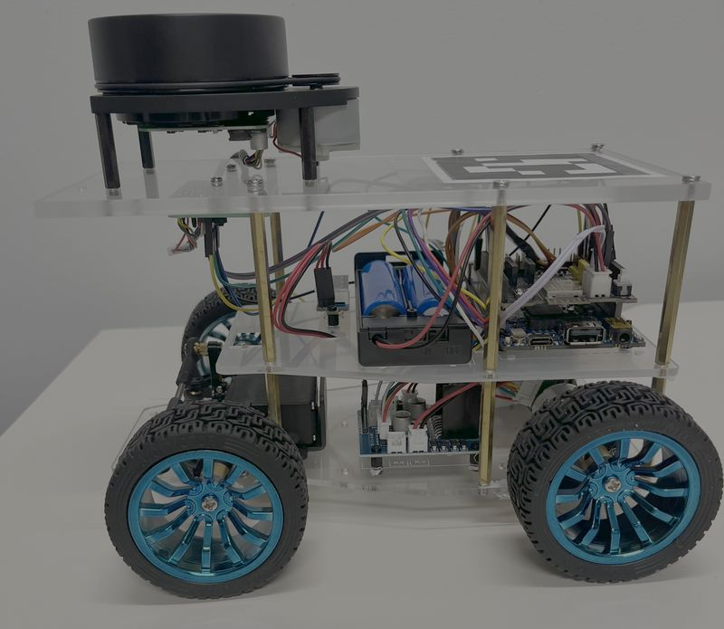
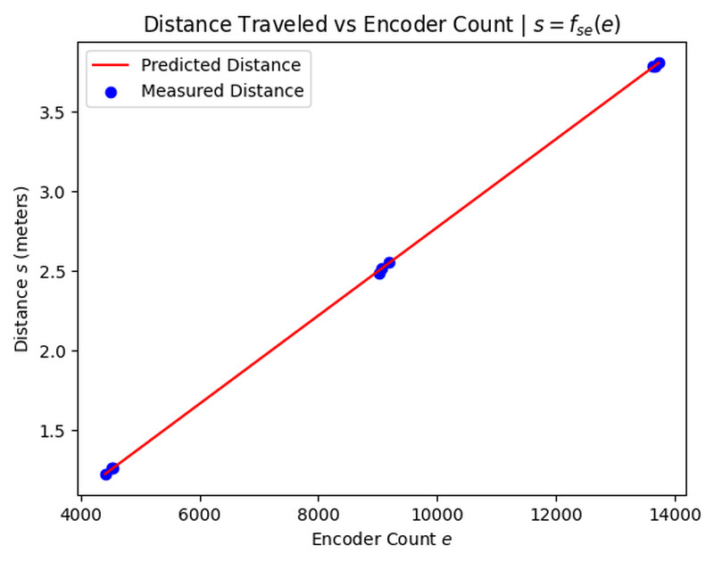
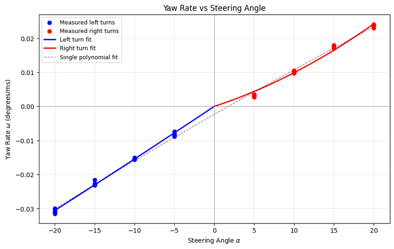
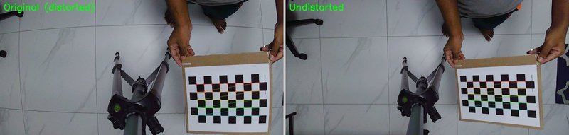
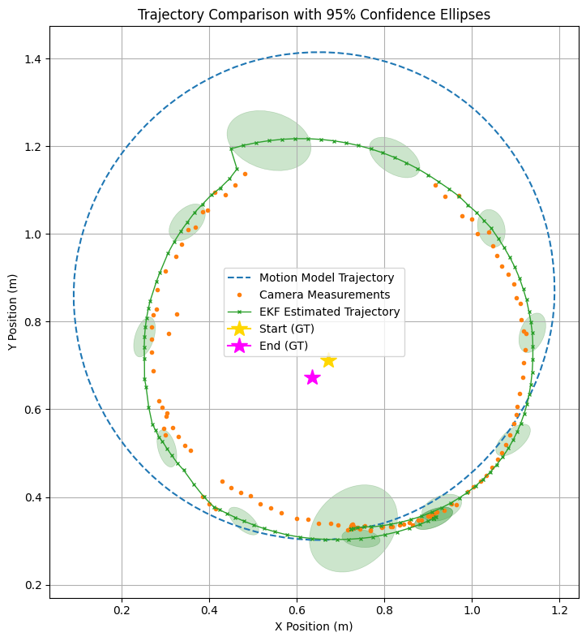
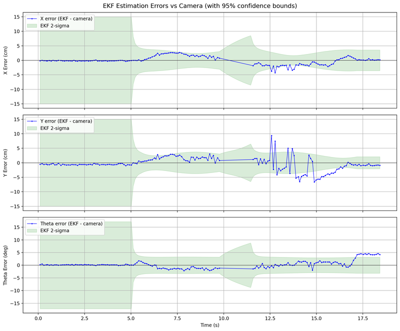
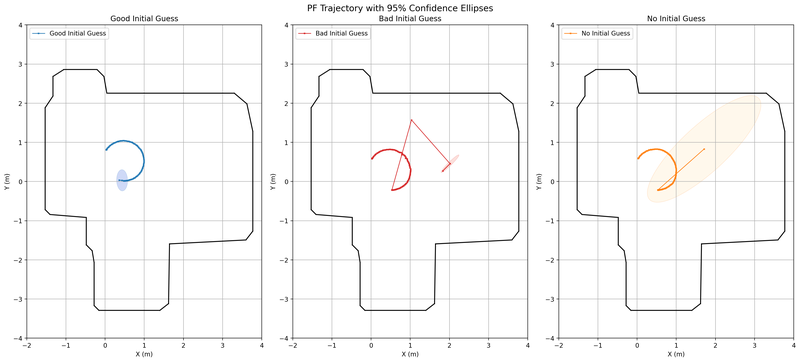
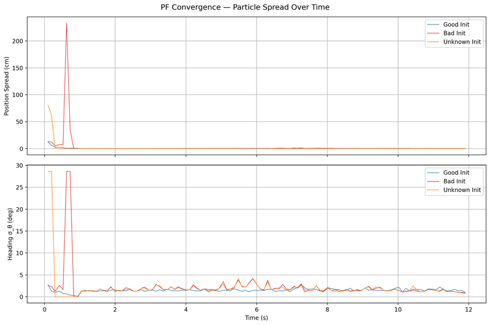
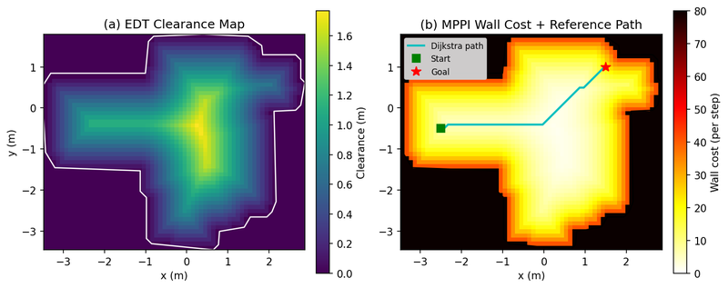
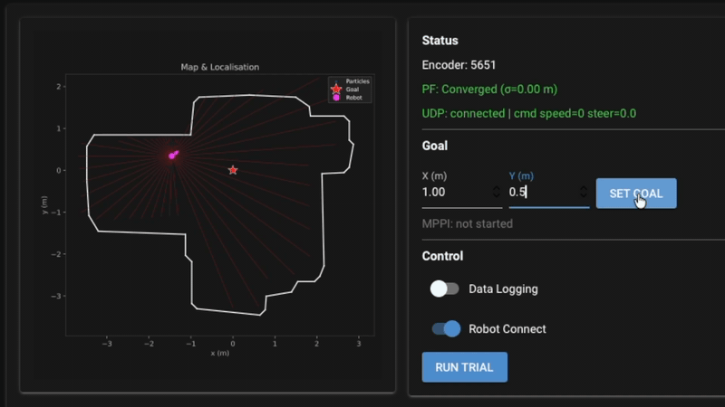

# NYU ROB-GY 6213: Robot Localization and Navigation

Labs from the NYU graduate course [ROB-GY 6213: Robot Localization and Navigation](https://sites.google.com/nyu.edu/rob-gy6213/). Each lab builds progressively toward a full autonomous navigation stack. All algorithms are implemented from scratch and deployed on a physical differential-drive robot.



## Labs

- [NYU ROB-GY 6213: Robot Localization and Navigation](#nyu-rob-gy-6213-robot-localization-and-navigation)
  - [Labs](#labs)
  - [Lab 1 — Robot Setup \& Data Collection](#lab-1--robot-setup--data-collection)
  - [Lab 2 — Motion Model Identification](#lab-2--motion-model-identification)
  - [Lab 3 — Camera Calibration, Marker Tracking \& EKF Localization](#lab-3--camera-calibration-marker-tracking--ekf-localization)
  - [Lab 4 — Particle Filter Localization](#lab-4--particle-filter-localization)
  - [Lab 5 — MPPI Navigation](#lab-5--mppi-navigation)

---

## Lab 1 — Robot Setup & Data Collection

Established real-time wireless communication between a host laptop and the robot's ESP32 microcontroller over UDP/WiFi, with custom firmware written in C++ for the Arduino platform. Synchronized data streams from wheel encoders, steering potentiometer, and an overhead ArUco-based vision system are logged to disk for use in subsequent labs. This end-to-end pipeline (from embedded firmware through to structured Python data collection) forms the hardware interface layer for all later work.

**Stack:** Python · Arduino (C++) · OpenCV · UDP/WiFi

```
base_code_lab_01/
├── robot_arduino_code/   # ESP32 firmware — UDP communication & sensor readout
└── robot_python_code/    # Synchronized data logging & ArUco pose extraction
```

---

## Lab 2 — Motion Model Identification

Designed and conducted controlled experiments on the physical robot to collect ground-truth trajectory data for straight-line and steering maneuvers. Parametric kinematic models were fitted from scratch using nonlinear least squares regression, capturing the nonlinear mapping from encoder ticks to displacement and from steering command to turning radius. These calibrated models are the foundation of the probabilistic state estimator in Lab 4.

**Stack:** Python · NumPy · SciPy · Matplotlib

<p float="left">
  
  
</p>

*Left: distance traveled vs. encoder count with the fitted linear model overlay, showing tight agreement between predicted and measured values. Right: yaw rate vs. steering angle for both left (blue) and right (red) turns, with separate polynomial fits capturing the slight asymmetry in the robot's steering mechanics.*

```
base_code_lab_02/
├── robot_python_code/
│   ├── data_fitting_straight.ipynb   # Distance model regression
│   ├── data_fitting_steer.ipynb      # Steering radius regression
│   └── motion_models.py              # Kinematic model implementation
```

---

## Lab 3 — Camera Calibration, Marker Tracking & EKF Localization

Performed full camera calibration on an overhead RGB camera using a checkerboard pattern, solving for the 3x3 intrinsic matrix and lens distortion coefficients via Zhang's method. The calibrated camera tracks ArUco fiducial markers mounted on the robot, providing global pose observations at camera frame rate. These measurements are fused with high-frequency wheel odometry inside an Extended Kalman Filter (EKF) implemented from scratch. The nonlinear unicycle kinematics form the prediction step, and the ArUco pose serves as the linear correction step. The EKF was validated both off-line and live on the physical robot, achieving a steady-state positional RMSE of 4.1 cm and recovering from initial pose errors within 0.1 s.

**Stack:** Python · OpenCV · ArUco · NumPy



*Overhead camera frame before (left) and after (right) applying the calibrated distortion correction. The curved tile grout lines and checkerboard edges are straightened, eliminating systematic errors in the ArUco pose estimates.*

<p float="left">
  
  
</p>

*Left: EKF estimated trajectory (green) on a circular path compared to raw odometry (blue dashed) and sparse camera measurements (orange). Confidence ellipses grow when the robot leaves the camera's field of view and shrink upon re-entry, showing uncertainty management in real time. Right: per-axis position and heading error vs. time with 95% confidence bounds, confirming steady-state tracking within 4 cm.*

```
base_code_lab_03/
├── camera_calibration.ipynb   # Intrinsic calibration & distortion fitting
├── camera_tracking.ipynb      # ArUco tracking & EKF sensor characterization
├── calibration_data.json      # Saved camera matrix & distortion coefficients
└── aruco_markers.pdf          # Printed fiducial markers
```

---

## Lab 4 — Particle Filter Localization

Implemented a full Monte Carlo Localization (MCL) algorithm from scratch, including the motion update, LiDAR beam model likelihood computation, systematic resampling, and adaptive reinitialization. The particle filter fuses real RPLidar scans with the calibrated motion model to estimate the robot's 2D pose within a pre-built occupancy map. Performance was benchmarked under three initial conditions: accurate prior, wide uniform prior, and completely unknown initialization.

**Stack:** Python · NumPy · RPLidar



*Three initialization conditions evaluated in the same occupancy map: accurate prior (blue), incorrect prior (red), and completely unknown pose (orange). All three converge to the true circular path within the first few LiDAR scans, with 95% confidence ellipses collapsing rapidly as distinct wall features disambiguate the pose estimate.*



*Position spread (top) and heading spread (bottom) over time for all three conditions. The bad and unknown initializations spike at startup before converging to near-zero spread within 1 s, matching the well-initialized baseline and confirming robust global localization from an arbitrary starting pose.*

```
base_code_lab_04/
├── create_map/              # LiDAR map acquisition via robot teleoperation
├── robot_python_code/
│   ├── particle_filter.py   # MCL — motion update, beam model, resampling
│   ├── motion_models.py     # Calibrated kinematic models from Lab 2
│   └── pf_performance.ipynb # Quantitative evaluation & visualization
```

---

## Lab 5 — MPPI Navigation

Closed the full autonomy loop by integrating the particle filter localizer with a Model Predictive Path Integral (MPPI) controller, both implemented from scratch. A Euclidean Distance Transform (EDT) of the occupancy map converts obstacle geometry into a continuous clearance field used as a cost function. At each control step, MPPI samples thousands of stochastic candidate trajectories forward in time, weights them by a composite cost (goal proximity, path following, and obstacle clearance), and computes a smoothed optimal control via an importance-weighted average. The full pipeline runs in real time on a laptop connected to the physical robot.

**Stack:** Python · NumPy · SciPy

<p float="left">
  
  
</p>

*Left: EDT clearance heatmap computed from the occupancy map. Brighter regions indicate greater distance from obstacles, forming the basis of the MPPI collision-avoidance cost. Right: real-time demo of the robot navigating autonomously to a goal while avoiding obstacles using the MPPI controller on live hardware.*

```
base_code_lab_05/
├── robot_python_code/
│   ├── mppi.py              # MPPI controller — trajectory sampling & cost weighting
│   ├── edt.py               # Euclidean Distance Transform for clearance cost
│   ├── particle_filter.py   # Localization (from Lab 4)
│   └── robot_python_code.py # Full autonomy loop — localize, plan, act
```
